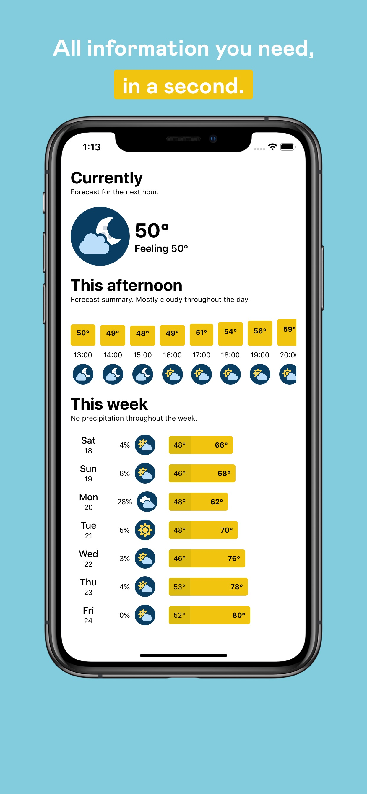
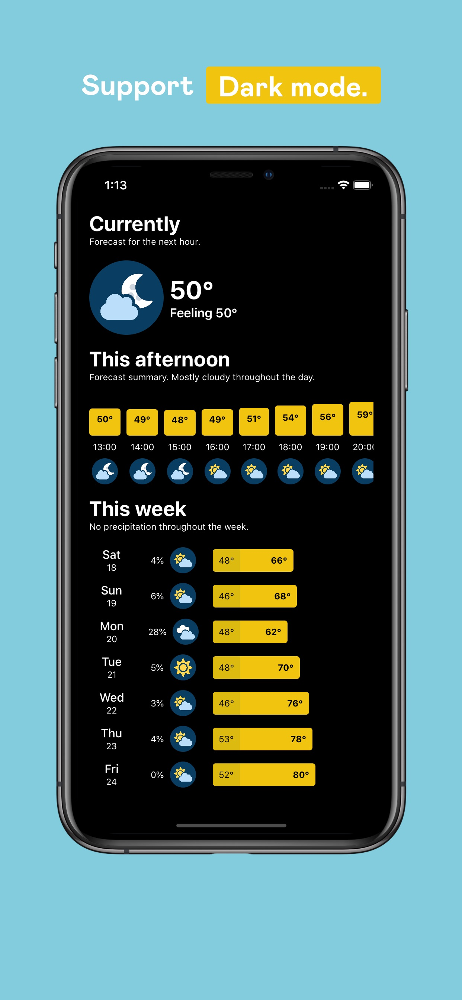

# Weathery

## Project description

Accessible weather app for the blind and visually impaired

## How to run

* Download Xcode 11.4 or higher
* Put your Dark Sky Api key in `Weather/Util/DarkSky.swift`

## Dependencies

* [RxSwift](https://github.com/ReactiveX/RxSwift) - Reactive Programming in Swift
* [Firabse](https://github.com/firebase/firebase-ios-sdk) - Firebase iOS SDK
* [R.Swift](https://github.com/mac-cain13/R.swift) - Get strong typed, autocompleted resources like images, fonts and segues in Swift projects

## Todo

- [x] Errors handling
- [ ] Show your location name
- [ ] Information sheet (Air quality, UV ...)
- [ ] Map with temperatures, precipitation, clouds
- [ ] Widget
- [ ] Choose other location
- [ ] Real-time alert (strong thunderstorm, intense rain, risk of tornado ...)
- [ ] Dedicaded app on Apple Watch, Mac and AppleTV
- [ ] IMessage extension
